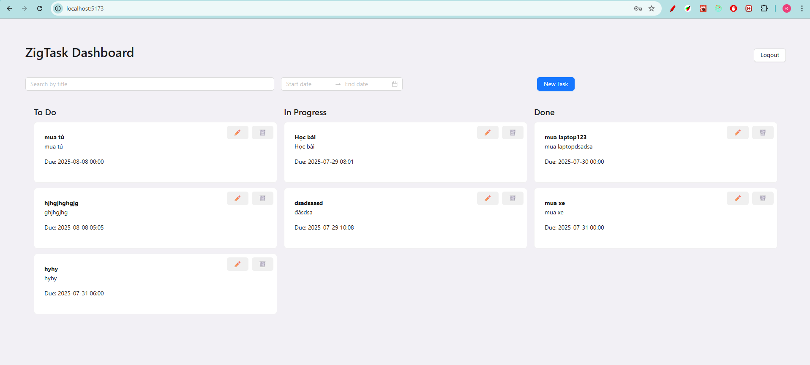

🖥️ ZigTask Client (Frontend - React + TS + Ant Design)

📌 Project Overview

ZigTask là giao diện web để người dùng quản lý các công việc. Các task được nhóm theo trạng thái và hỗ trợ drag-and-drop, lọc theo thời gian và tìm kiếm tiêu đề, sạch sẽ, Sign up / Sign in, thông báo cảnh báo khi task còn 1 tiếng.

⚙️ Setup & Run Instructions

1. Clone repo

git clone https://github.com/hangduchuy/zigvy-interview-homework.git
cd zigvy-interview-homework
cd Frontend

2. Cài đặt dependencies

Node: 20.14.0
npm install

3. Khởi chạy dev

npm run dev

Yêu cầu: Backend chạy ở http://localhost:3000

🧠 Decisions & Trade-offs

Sử dụng Context API thay vì Redux để giảm boilerplate cho ứng dụng nhỏ.

Ant Design giúp build giao diện nhanh, đồng thời có hỗ trợ tốt về UX/UI.

Drag-and-drop dùng @hello-pangea/dnd do dễ dùng và lightweight hơn so với react-beautiful-dnd.

Tối ưu UX bằng optimistic update và toast thông báo khi task gần đến hạn.

📸 Screenshots

📘 API Swagger Docs

Tại backend: http://localhost:3000/docs
